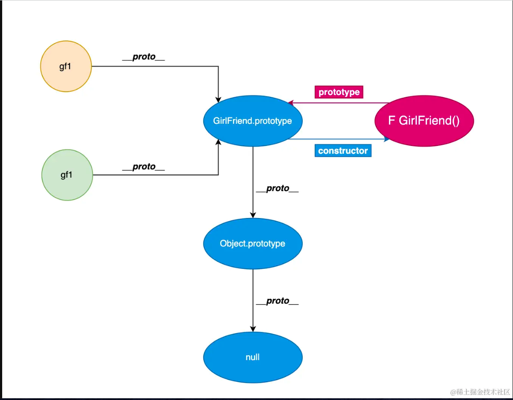
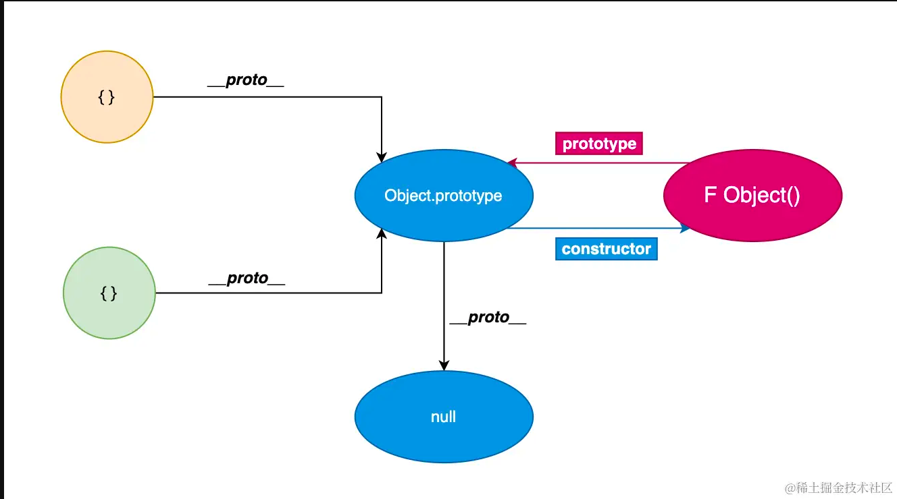
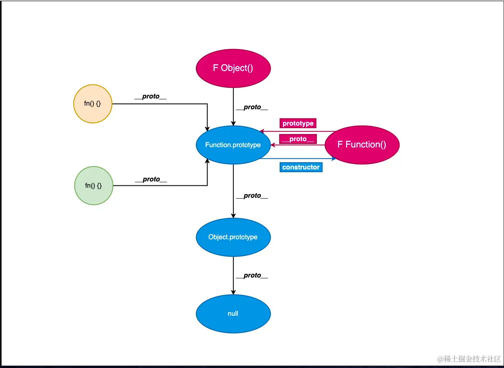
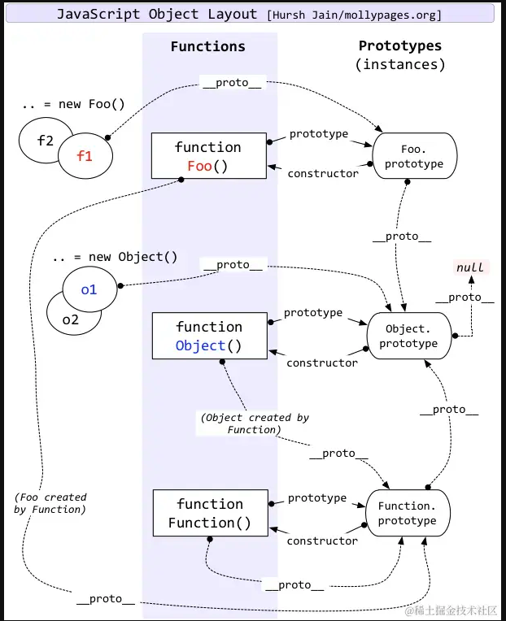

# js执行过程

1. 词法分析：将代码的字符串分析得到词法单元token
2. 语法分析：将词法单元流解析成AST（抽象语法树），该过程包括词法作用域的生成、变量提升等阶段
3. 代码生成：AST转换成字节码，这部分有V8中的lgnition解释器来生成的
4. 代码执行：逐条解释执行字节码，注意了，当 V8 发现有大量重复字节码时（热点代码 HotSpot ），会将其编译成机器码（由引擎中 TurboFan 编译器进行编译），下次再碰到类似字节码不需要解释，直接执行，这种与解释器配合的过程也称为 ***JIT （即时编译）***。
5. 垃圾回收


# js作用域与作用域链

在es5之前，js只有**全局作用域**及**函数作用域**。es6引入了块级作用域。但是这个块级别作用域需要注意的是不是`{}`的作用域，而是`let`，`const`关键字的**块级作用域**

作用域链：[[scope]]中所存储的执行期上下文对象的`集合`，这个集合呈`链式连接`，我们把这种链式连接叫做`作用域链`

copy from [掘金文章地址](https://juejin.cn/post/7287524648808366091)

很明了，就不自己写了:smile:

#### 函数

先来看一下上古时期的工作中我们是如何定义函数的，直接使用 `function` 关键字来声明

```js
function fun() {}
```

但是有的时候我们会发现函数也会用下面的这种格式来定义

```js
function Fun() {}
```

除了第二个 **函数名的首字母大写之外**，本质上两者毫无区别 

#### 函数名首字母大写的意义

当我们需要将一个函数作为 **构造函数** 使用时，通常会将函数名首字母大写，为了看起来规范一些，仅此而已 

#### 实例化

对 **构造函数** 使用 `new` 关键字可以创建出不同的 **实例（实例的本质就是一个对象）**，就好比说：你没有女朋友，但是你可以准备一个构造函数 new 很多女朋友出来，就是这个意思！

#### 开造

- 构造函数（女朋友构造器）：

```js
function GirlFriend() {}
```

- 创建第一个 gf1 （实例对象）

```javascript
const gf1 = new GirlFriend()

gf1.name = '小美'
gf1.age = 18

console.log(gf1)  // {name: '小美', age: 18}
```

- 创建第二个 gf2 （实例对象）

```javascript
const gf2 = new GirlFriend()

gf2.name = '小丽'
gf2.age = 19

console.log(gf2) // {name: '小丽', age: 19}
```


#### 关联

- `GirlFriend` 是一个 **构造函数**
- `gf1` 和 `gf2` 是通过 `new GirlFriend` 创建出来的两个 **实例对象**

那如何将 **实例对象** 和 **构造函数** 联系在一起呢？

- 在 **实例对象** 上会默认存在一个属性叫做 `__proto__`，这里记作 **隐式原型**
- 在 **构造函数** 上会默认存在一个属性叫做 `prototype`，这里记作 **显示原型 **

通常我们所说的 **原型对象** 也就是指这里的 `prototype`，**原型对象** 上的 `constructor`属性可以直接访问该 **构造函数**（这里建议手动打印观察一下）
默认情况下，**实例对象** 的 `__proto__` 指向 **构造函数** 的 `prototype`，如果你想访问某个实例的原型对象，就可以通过如下关系来进行访问

```javascript
console.log(GirlFriend.prototype.constructor) // ƒ GirlFriend() {}
gf1.__proto__ === GirlFriend.prototype // true
gf2.__proto__ === GirlFriend.prototype // true
```


#### 访问

当我需要访问 **实例对象** 上存在的属性，比如 `name` 时：

```javascript
console.log(gf1.name) // '小美'
console.log(gf2.name) // '小丽'
```

当我需要访问 **实例对象** 上不存在的属性，比如 `feature` 时：

```javascript
console.log(gf1.feature) // undefined
console.log(gf2.feature) // undefined
```

因为没有这个属性，自然而然就会打印 `undefined`
但如果说我想添加一个共同的属性给所有被 **实例化的对象** 时，我该如何去处理呢？

- 上面已经说明，被同一个 **构造函数** 创建出来的 **实例对象** ，默认情况下他们的 **隐式原型** 都会指向该构造函数的 **显示原型** ，也就是 `GirlFriend.prototype`，因此我只需要在往这个原型上去添加就好

```javascript
GirlFriend.prototype.feature = 'beautiful'
```

此时再次访问实例上的 `feature`属性，最终即可得到正常的打印

```javascript
console.log(gf1.feature) // beautiful
console.log(gf2.feature) // beautiful
```

如果说我想单独给 `gf1` 添加不一样的 `feature` 再访问呢

```javascript
gf1.feature = 'pretty'

console.log(gf1.feature) // pretty
console.log(gf2.feature) // beautiful
```

但是，为什么我给 **显示原型** 添加的属性可以直接通过实例对象进行访问呢？ 

#### 原理

1. 每一个被 **构造函数** 创建的 **实例对象** 都是一个全新的 **对象** ，我们可以为该对象添加本身特有的属性
2. 当我们尝试访问 **实例对象** 上的某个属性时，如果存在则会直接返回该属性的值；如果不存在，就会沿着 **实例对象** 的 `__proto__` 继续向上访问，如果查找到则会返回该属性的值，如果没有找到，则会返回 `undefined`



#### 注意

为了更加清晰的了解原型，这里我们再提及 js 中几个比较关键的点 

###### 普通对象 - object

- 只要是一个普通对象`object`，就可以用 `new Object()` 来实例化（**Object() 是一个内置的构造函数**），也就是说，所有的对象字面量都是 `Object()` 的实例
- `Object` 作为构造函数，`Object.prototype` 指向一个具体的 **原型对象** ，该 **原型对象** 作为对象的实例，它的 `__proto__` 值为 `null`，因而 `Object.prototype.__proto__ = null` 时也就走到了 **原型的尽头**

```javascript
const obj = {}
const obj1 = new Object()

console.log(obj.__proto__ === obj1.__proto__)  // true
console.log(obj1.__proto__ === Object.prototype) // true
console.log(Object.prototype.____proto__) // null
```



回到上面那个例子，当我要访问 **实例对象** `gf1` 上的属性时：

- 如果该属性存在，就会直接返回对应的值

- 如果该属性不存在，就会沿着 

  ```
  gf1.__proto__
  ```

   进行查找，本质上查找的就是 

  ```
  GirlFriend.prototype
  ```

   这个对象

  - 如果该属性存在，就会直接返回对应的值
  - 如果该属性不存在，那么 `GirlFriend.prototype`作为 `Object`的实例对象，其本身也是存在`__proto__`属性的，所以会沿着 `GirlFriend.prototype.__proto__`来进行查找，本质上查找的就是`Object.prototype`
    - 如果该属性存在，就会直接返回对应的值
    - 如果不存在，就会查找接着查找 `Object.prototype.__proto__` ，此时 `Object.prototype.__proto__` 值为 `null` ，最终没有找到该属性，打印 `undefined`

这个顺序很好理解

1. `gf1.xx`
2. `gf1.__proto__.xx`
3. `gf1.__proto__.__proto__.xx`
4. `gf1.__proto__.__proto__.__proto__.xx`

当最终 `__proto__` 为 `null` 都没有找到时就会打印 `undefined`
因此，沿着 `__proto__` 访问对象属性构成的这一条链也就是平时所说的 **原型链** 

###### 特殊对象 - function

- `function` 也算是一类特殊的对象，因此可以直接通过属性的形式来进行变量的访问
- 已经内置了 **Function() 构造函数** ，因而 **所有函数** 都算作是 `Function` 的 **实例对象**
  - 当 `Function` 作为 **构造函数** 时，可以访问其 `prototype` 属性
  - 当 `Function` 作为 **实例对象** 时，可以访问其 `__proto__` 属性

```javascript
// 在 Function 这里就是：我实例化了我寄几
console.log(Function.__proto__ === Function.prototype) // true
console.log(Function.prototype.constructor === Function) // true
```

- 内置的 `Object()` 也是一个函数，因此 `Object` 也是我 `Function` 的 **实例对象**

```javascript
console.log(Object.__proto__ === Function.prototype) // true
```



#### 经典图示




# 变量提升
```js
console.log(a)  //输出的是undifined，而不是ReferenceError
var a = 10  

foo() //这个函数是undifined，报错
var foo = function () {
  console.log("foo1")
}
```
- var定义的变量会变量提升，所以声明会被拿到函数或全局作用域的顶部，并且输出undifined。所以执行foo()的时候，foo是undifined，所以会报错。由于js按照顺序从上往下，所以当执行foo = function(){}的时候，才对foo进行赋值为一个函数。
- 这种定义函数的方式，我们称为函数表达式。函数表达式是将函数作为一个值赋给一个变量或属性

```js
function foo() {
  console.log("foo1")
}
foo()

function foo() {
  console.log("foo2")
}
foo()
```
- 函数声明会在任何代码执行之前先被读取并添加到执行上下文，也就是函数声明提升，因此第二个foo会覆盖掉第一个foo，所以输出的是两个foo

```js
var foo = function () {
    console.log("foo1")
}
foo()

var foo = function () {
    console.log("foo2")
}
foo()


function foo() {
    console.log("foo3")
}
foo()

function foo() {
    console.log("foo4")
}
foo()
```
- 函数的变量提升优先级比var高，因此后两个foo提升上去后，被 `var foo`给覆盖了，隐藏最后执行函数`foo()`的时候，都是执行第二个`var foo`，所以输出的是foo1和3个foo2

```js
var a = 0
console.log("1 a:"+a)
if (true) {
  a = 1
  function a() {}
  a = 5
  console.log("2 a:"+a)
}
console.log("3 a:"+a)
```
- js执行是按顺序从上到下的，因此先输出0
- 在if里面，也就是块级作用域，存在函数a，而在ES6之后，块级作用域中的函数声明会提升到全局，虽然提升到全局，但只有执行到这个函数的时候才会去重写块中生成对应的全局变量，否则就是重写之前声明的全局变量
- 没有变量提升后，按顺序执行`a = 1`，if作用域不存在a，因此会向外寻找，因此赋值给全局中的变量a，此时变量a的值为1
- 开始执行函数a，形成函数作用域，此时的a是一个函数
- 执行`a = 5`，此时的a是一个局部变量，不是外面的全局变量，因此输出的是5
- 此时全局变量当中的a是1，因此输出1

> 函数提升优先级高于变量提升，且不会被同名变量声明时覆盖，但是会被同名变量赋值后覆盖
> 变量提升是假提升，函数的提升是真提升，赋值后的同名变量优先级要高于同名函数

JavaScript中具名的函数的声明形式有两种：
```js
//函数声明式：
function foo () {}
//变量形式声明： 
var fn = function () {}
```
当使用变量形式声明函数时，和普通的变量一样会存在提升的现象，而函数声明式会提升到作用域最前边，并且将声明内容一起提升到最上边。如下：
```js
fn()
var fn = function () {
	console.log(1)  
}
// 输出结果：Uncaught TypeError: fn is not a function

foo()
function foo () {
	console.log(2)
}
// 输出结果：2
```
可以看到，使用变量形式声明fn并在其前面执行时，会报错fn不是一个函数，因为此时fn只是一个变量，还没有赋值为一个函数，所以是不能执行fn方法的。

## 变量提升导致的问题

### 变量被覆盖

```js
var name = "JavaScript"
function showName(){
  console.log(name);
  if(0){
   var name = "CSS"
  }
}
showName()
```

执行这段代码需要使用变量 name，代码中有两个 name 变量：一个在全局执行上下文中，其值是JavaScript；另外一个在 showName 函数的执行上下文中，由于if(0)永远不成立，所以 name 值是 undifined。那该使用哪个呢？**应该先使用函数执行上下文中的变量**。因为在函数执行过程中，JavaScript 会优先从当前的执行上下文中查找变量，由于变量提升的存在，当前的执行上下文中就包含了if(0)中的变量 name，其值是 undefined，所以获取到的 name 的值就是 undefined。

### 变量没有被销毁

```js
function foo(){
  for (var i = 0; i < 5; i++) {
  }
  console.log(i); 
}
foo()
```

使用其他的大部分语言实现类似代码时，在 for 循环结束之后，i 就已经被销毁了，但是在 JavaScript 代码中，i 的值并未被销毁，所以最后打印出来的是 5。这也是由变量提升而导致的，在创建执行上下文阶段，变量 i 就已经被提升了，所以当 for 循环结束之后，变量 i 并没有被销毁。


# 词法环境

词法环境是一个包含标识符变量映射的结构。（这里的标识符表示变量/函数的名称，变量是对实际对象【包括函数类型对象】或原始值的引用）。在词法环境中，有两个组成部分：（1）环境记录（environment record） （2）对外部环境的引用

- 环境记录是存储变量和函数声明的实际位置。
- 对外部环境的引用意味着它可以访问其外部词法环境。(实现作用域链的重要部分)
  

词法环境有两种类型：

- **全局环境**（在全局执行上下文中）是一个没有外部环境的词法环境。全局环境的外部环境引用为 null。它拥有一个全局对象（window 对象）及其关联的方法和属性（例如数组方法）以及任何用户自定义的全局变量，this 的值指向这个全局对象。
- **函数环境**，用户在函数中定义的变量被存储在环境记录中。对外部环境的引用可以是全局环境，也可以是包含内部函数的外部函数环境。

变量环境 Variable Environment

它也是一个词法环境，其 `EnvironmentRecord` 包含了由 `VariableStatements` 在此执行上下文创建的绑


变量环境组件（VariableEnvironment） 是用来登记var function变量声明，词法环境组件（LexicalEnvironment）是用来登记let const class等变量声明。

在ES6之前都没有块级作用域，ES6之后我们可以用let const来声明块级作用域，有这两个词法环境是为了实现块级作用域的同时不影响var变量声明和函数声明，具体如下：

1. 首先在一个正在运行的执行上下文内，词法环境由LexicalEnvironment和VariableEnvironment构成，用来登记所有的变量声明。

2. 当执行到块级代码时候，会先LexicalEnvironment记录下来，记录为oldEnv。

3. 创建一个新的LexicalEnvironment（outer指向oldEnv），记录为newEnv，并将newEnv设置为正在执行上下文的LexicalEnvironment。

4. 块级代码内的let const会登记在newEnv里面，但是var声明和函数声明还是登记在原来的VariableEnvironment里。

5. 块级代码执行结束后，将oldEnv还原为正在执行上下文的LexicalEnvironment。
   


# 浅拷贝、深拷贝

```js
const obj = {
  name: 'test',
  age: 18,
  height: 188,
  money: {
    jijing: 5000
  }
}
// 引用赋值，修改obj2的值，obj的值也会改，本质上obj和ibj2都指向同一个堆数据
const obj2 = obj
console.log('obj', obj2)
obj2.name = 'dawei'
console.log('obj', obj2)
console.log('obj', obj)

// 浅拷贝，值拷贝第一层，其他的依旧是引用赋值
const obj3 = {
  ...obj
}
console.log('obj', obj3)
obj3.name = 'dawei'
obj3.money.jijing = 10000
console.log('obj', obj3)
console.log('obj', obj)

// 深拷贝，完全独立的一个
const obj4 = JSON.parse(JSON.stringify(obj))
console.log('obj', obj4)
obj4.name = 'dawei'
obj4.money.jijing = 10000
console.log('obj', obj4)
console.log('obj', obj)
```


# ES8-对象相关的属性

```js
const obj = {
  name: "why",
  age: 18,
  height: 1.88,
  address: "广州市"
}

// 1.获取所有的key
const keys = Object.keys(obj)
console.log(keys)
//["name","age","height","address"]

// 2.ES8 Object.values
const values = Object.values(obj)
console.log(values)
//["why",18,1.88,"广州市"]

// 3.ES8 Object.entries
// 3.1. 对对象操作
const entries = Object.entries(obj)
console.log(entries)
//[["name","why"],["age",18],["height",1.88],[="address",="广州市"]]
for (const entry of entries) {
  const [key, value] = entry
  console.log(key, value)
  //name why
	//age 18
	//height 1.88
	//address 广州市
}

// 3.2. 对数组/字符串操作(了解)
console.log(Object.entries(["abc", "cba"]))
//[["0","abc"],["1","cba"]]
console.log(Object.entries("Hello"))
//[["0","H"],["1","e"],["2","l"],["3","l"],["4","o"]]
```


# 事件循环机制

> promise本身是一个同步的代码，只有它后面调用的then()方法里的回调才是微任务
>
> await右边的表达式还是会
>
> script标签本身是一个宏任务，当页面出现多个script标签的时候，浏览器会把script标签作为宏任务来解析


# set、map、reduce

### Set

#### 去重

使用 Set 可以轻松地进行数组去重操作，因为 Set 只能存储唯一的值。

```javascript
const arr = [1, 2, 3, 1, 2, 4, 5];
const uniqueArr = [...new Set(arr)];
console.log(uniqueArr); // [1, 2, 3, 4, 5]
```

#### 数组转换

可以使用 Set 将数组转换为不包含重复元素的 Set 对象，再使用 Array.from() 将其转换回数组。

```javascript
const arr = [1, 2, 3, 1, 2, 4, 5];
const set = new Set(arr);
const uniqueArr = Array.from(set);
console.log(uniqueArr); // [1, 2, 3, 4, 5]
```

#### 优化数据查找

使用 Set 存储数据时，查找操作的时间复杂度为 O(1)，比数组的 O(n) 要快得多，因此可以使用 Set 来优化数据查找的效率。

```js
const dataSet = new Set([1, 2, 3, 4, 5]);

if (dataSet.has(3)) {
  console.log('数据已经存在');
} else {
  console.log('数据不存在');
}
```

#### 并集、交集、差集

Set数据结构可以用于计算两个集合的并集、交集和差集。以下是一些使用Set进行集合运算的示例代码：

```js
const setA = new Set([1, 2, 3]);
const setB = new Set([2, 3, 4]);

// 并集
const union = new Set([...setA, ...setB]);
console.log(union); // Set {1, 2, 3, 4}

// 交集
const intersection = new Set([...setA].filter(x => setB.has(x)));
console.log(intersection); // Set {2, 3}

// 差集
const difference = new Set([...setA].filter(x => !setB.has(x)));
console.log(difference); // Set {1}
```

#### 模糊搜索

Set 还可以通过正则表达式实现模糊搜索。可以将匹配结果保存到 Set 中，然后使用 Array.from() 方法将 Set 转换成数组。

```javascript
const data = ['apple', 'banana', 'pear', 'orange'];

// 搜索以 "a" 开头的水果
const result = Array.from(new Set(data.filter(item => /^a/i.test(item))));
console.log(result); // ["apple"]
```

#### 使用 Set 替代数组实现队列和栈

可以使用 Set 来模拟队列和栈的数据结构。

```js
// 使用 Set 实现队列
const queue = new Set();
queue.add(1);
queue.add(2);
queue.add(3);
queue.delete(queue.values().next().value); // 删除第一个元素
console.log(queue); // Set(2) { 2, 3 }

// 使用 Set 实现栈
const stack = new Set();
stack.add(1);
stack.add(2);
stack.add(3);
stack.delete([...stack][stack.size - 1]); // 删除最后一个元素
console.log(stack); // Set(2) { 1, 2 }
```

### Map

#### 将 Map 转换为对象

```js
const map = new Map().set('key1', 'value1').set('key2', 'value2');
const obj = Object.fromEntries(map);
```

#### 将 Map 转换为数组

```js
const map = new Map().set('key1', 'value1').set('key2', 'value2');
const array = Array.from(map);
```

#### 记录数据的顺序

如果你需要记录添加元素的顺序，那么可以使用`Map`来解决这个问题。当你需要按照添加顺序迭代元素时，可以使用`Map`来保持元素的顺序。

```javascript
const map = new Map();
map.set('a', 1);
map.set('b', 2);
map.set('c', 3);
map.set('d', 4);

for (const [key, value] of map) {
  console.log(key, value);
}
// Output: a 1, b 2, c 3, d 4
```

#### 统计数组中元素出现次数

可以使用 Map 统计数组中每个元素出现的次数。

```javascript
const arr = [1, 2, 3, 1, 2, 4, 5];

const countMap = new Map();
arr.forEach(item => {
  countMap.set(item, (countMap.get(item) || 0) + 1);
});

console.log(countMap.get(1)); // 2
console.log(countMap.get(2)); // 2
console.log(countMap.get(3)); // 1
```

#### 统计字符出现次数

使用Map数据结构可以方便地统计字符串中每个字符出现的次数。

```javascript
const str = 'hello world';
const charCountMap = new Map();
for (let char of str) {
  charCountMap.set(char, (charCountMap.get(char) || 0) + 1);
}
console.log(charCountMap); // Map { 'h' => 1, 'e' => 1, 'l' => 3, 'o' => 2, ' ' => 1, 'w' => 1, 'r' => 1, 'd' => 1 }
```

#### 缓存计算结果

在处理复杂的计算时，可能需要对中间结果进行缓存以提高性能。可以使用Map数据结构缓存计算结果，以避免重复计算。

```javascript
const cache = new Map();
function fibonacci(n) {
  if (n === 0 || n === 1) {
    return n;
  }
  if (cache.has(n)) {
    return cache.get(n);
  }
  const result = fibonacci(n - 1) + fibonacci(n - 2);
  cache.set(n, result);
  return result;
}
console.log(fibonacci(10)); // 55
```

#### 使用 Map 进行数据的分组

```javascript
const students = [
  { name: "Tom", grade: "A" },
  { name: "Jerry", grade: "B" },
  { name: "Kate", grade: "A" },
  { name: "Mike", grade: "C" },
];

const gradeMap = new Map();
students.forEach((student) => {
  const grade = student.grade;
  if (!gradeMap.has(grade)) {
    gradeMap.set(grade, [student]);
  } else {
    gradeMap.get(grade).push(student);
  }
});

console.log(gradeMap.get("A")); // [{ name: "Tom", grade: "A" }, { name: "Kate", grade: "A" }]
```

#### 使用 Map 过滤符合条件的对象

在实际开发中，我们常常需要在一个对象数组中查找符合某些条件的对象。此时，我们可以结合使用 Map 和 filter 方法来实现。比如：

```javascript
const users = [
  { name: 'Alice', age: 22 },
  { name: 'Bob', age: 18 },
  { name: 'Charlie', age: 25 }
];
const userMap = new Map(users.map(user => [user.name, user]));
const result = users.filter(user => userMap.has(user.name) && user.age > 20);
console.log(result); // [{ name: 'Alice', age: 22 }, { name: 'Charlie', age: 25 }]
```

首先，我们将对象数组转换为 Map，以便快速查找。然后，我们使用 filter 方法来过滤符合条件的对象。


### reduce

reduce 函数可以根据需要进行累加、过滤、分组、映射等操作，是一个非常强大的数组方法。在数据处理时使用的非常频繁，很多复杂的逻辑如果用reduce去处理，都非常的简洁，在实际的开发工作过程中，积累了一些常见又超级好用的 reduce 技巧的代码片段，筛选了如下 10 个，以供大家参考

#### reduce 介绍

`reduce` 是数组的方法，可以对数组中的每个元素依次执行一个回调函数，从左到右依次累积计算出一个最终的值。其语法为：

> arr.reduce(callback(accumulator, currentValue[, index[, array]])[, initialValue])

其中，`callback` 是每个元素执行的回调函数，其包含 4 个参数：

- `accumulator`：累积器，即上一次回调函数执行的返回值。
- `currentValue`：当前元素的值。
- `index`：当前元素的下标。
- `array`：原始数组。

`initialValue` 是可选的，表示累积器的初始值。

`reduce` 函数的执行过程如下：

1. 如果没有提供 `initialValue`，则将数组的第一个元素作为累积器的初始值，否则将 `initialValue` 作为累积器的初始值。
2. 从数组的第二个元素开始，依次对数组中的每个元素执行回调函数。
3. 回调函数的返回值作为下一次回调函数执行时的累积器的值。
4. 对数组中的每个元素执行完回调函数后，`reduce` 函数返回最后一次回调函数的返回值，即最终的累积值。

#### 计算数组中每个元素出现的次数

```js
const fruits = ['apple', 'banana', 'apple', 'orange', 'banana', 'apple'];
const count = fruits.reduce((accumulator, currentValue) => {
  accumulator[currentValue] = (accumulator[currentValue] || 0) + 1;
  return accumulator;
}, {});
console.log(count); // Output: { apple: 3, banana: 2, orange: 1 }
```

#### 拍平嵌套数组

```js
const nestedArray = [[1, 2], [3, 4], [5, 6]];
const flattenedArray = nestedArray.reduce((accumulator, currentValue) => accumulator.concat(currentValue), []);
console.log(flattenedArray); // Output: [1, 2, 3, 4, 5, 6]
```

#### 按条件分组

```js
const people = [
  { name: 'Alice', age: 25 },
  { name: 'Bob', age: 30 },
  { name: 'Charlie', age: 35 },
  { name: 'David', age: 25 },
  { name: 'Emily', age: 30 }
];
const groupedPeople = people.reduce((accumulator, currentValue) => {
  const key = currentValue.age;
  if (!accumulator[key]) {
    accumulator[key] = [];
  }
  accumulator[key].push(currentValue);
  return accumulator;
}, {});
console.log(groupedPeople);
// Output: {
//   25: [{ name: 'Alice', age: 25 }, { name: 'David', age: 25 }],
//   30: [{ name: 'Bob', age: 30 }, { name: 'Emily', age: 30 }],
//   35: [{ name: 'Charlie', age: 35 }]
// }
```

#### 将多个数组合并为一个对象

```js
const keys = ['name', 'age', 'gender'];
const values = ['Alice', 25, 'female'];
const person = keys.reduce((accumulator, currentValue, index) => {
    accumulator[currentValue] = values[index];
    return accumulator;
  }, {});
console.log(person); // Output: { name: 'Alice', age: 25, gender: 'female' }
```

#### 将字符串转换为对象

```js
const str = 'key1=value1&key2=value2&key3=value3';
const obj = str.split('&').reduce((accumulator, currentValue) => {
  const [key, value] = currentValue.split('=');
  accumulator[key] = value;
  return accumulator;
}, {});
console.log(obj); 
// Output: { key1: 'value1', key2: 'value2', key3: 'value3' }
```

#### 将对象转换为查询字符串

```js
const params = { foo: "bar", baz: 42 };
const queryString = Object.entries(params).reduce((acc, [key, value]) => {
  return `${acc}${key}=${value}&`;
}, "?").slice(0, -1);
console.log(queryString); // "?foo=bar&baz=42"
```

#### 打印斐波那契数列

```js
const fibonacci = n => {
  return [...Array(n)].reduce((accumulator, currentValue, index) => {
    if (index < 2) {
      accumulator.push(index);
    } else {
      accumulator.push(accumulator[index - 1] + accumulator[index - 2]);
    }
    return accumulator;
  }, []);
};
console.log(fibonacci(10)); // Output: [0, 1, 1, 2, 3, 5, 8, 13, 21, 34]
```

#### 检查字符串是否是回文字符串

```js
const str = 'racecar';
const isPalindrome = str.split('').reduce((accumulator, currentValue, index, array) => {
  return accumulator && currentValue === array[array.length - index - 1];
}, true);
console.log(isPalindrome); // Output: true
```

#### 检查括号是否匹配

```js
const str = "(()()())";
const balanced = str.split("").reduce((acc, cur) => {
  if (cur === "(") {
    acc++;
  } else if (cur === ")") {
    acc--;
  }
  return acc;
}, 0) === 0;
console.log(balanced); // true
```

#### 递归获取对象属性

```js
const user = {
  info: {
    name: "Jason",
    address: { home: "Shaanxi", company: "Xian" },
  },
};
function get(config, path, defaultVal) {
  return path.split('.').reduce((config, name) => config[name], config) || defaultVal;
}
get(user, "info.name"); // Jason
get(user, "info.address.home"); // Shaanxi
get(user, "info.address.company"); // Xian
get(user, "info.address.abc", "default"); // default
```

#### 手写 reduce

可以通过手写一个简单的 `reduce` 函数来更好地理解它的实现原理：

```js
function myReduce(arr, callback, initialValue) {
  let accumulator = initialValue === undefined ? arr[0] : initialValue;
  for (let i = initialValue === undefined ? 1 : 0; i < arr.length; i++) {
    accumulator = callback(accumulator, arr[i], i, arr);
  }
  return accumulator;
}
```

上面的代码中，`myReduce` 函数接受 3 个参数：要执行 `reduce` 操作的数组 `arr`、回调函数 `callback` 和累积器的初始值 `initialValue`。如果没有提供初始值，则将数组的第一个元素作为累积器的初始值。

接下来，在循环中，如果有 initialValue，则从第一个元素开始遍历 callback，此时 callabck 的第二个参数是从数组的第一项开始的；如果没有 initialValue，则从第二个元素开始遍历 callback，此时 callback 的第二个参数是从数组的第二项开始的从数组的第二个元素开始，依次对数组中的每个元素执行回调函数，并将返回值作为下一次回调函数执行时的累积器的值。

最后，`myReduce` 函数返回最后一次回调函数的返回值，即最终的累积值。

这个简易的 `reduce` 函数并没有考虑很多边界情况和复杂的应用场景，但是可以帮助我们更好地理解 `reduce` 函数的实现原理。